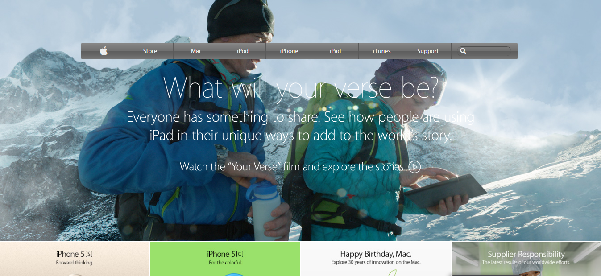

# Project 4 : Apple Webpage Clone
This is the clone of and old archived version of the apple homepage. The purpose of this project is to create a webpage from scratch that matches the an archived version of [apple.com](https://web.archive.org/web/20140301004610/http://www.apple.com/).
The main aim of this project is to learn about background and gradients in CSS.
# Screenshot
This is the screenshot  of my work.

# Built With
* HTML 5
* CSS 3
* Visual Studio Code Editor
# Live Demo
[Here](https://github.com/praz99/appleClone/blob/master/index.html) is the live demo of my work.
# Author
### Prajwal Thapa
* Github: [@praz99](https://github.com/praz99)

# Contributing
Contributions, issues and feature requests are welcome!
Feel free to check the [issues](https://github.com/praz99/appleClone/issues) page.